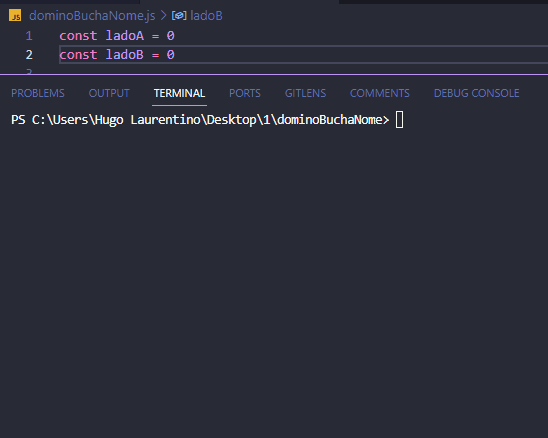

<h1 align="center">
  
</h1>

- [x] Bak-End
- [x] Criar Título
- [x] Criar Descrição
- [x] Sobre
- [x] Tecnologia
- [x] Pre requisito
- [x] Autor
- [x] GIF‘s

---
<h1 align='center'>Dominó dando nome as Buchas</h1>

<p align='center'>Esse é um exemplo de lógica em javascript</p>
<p align='center'>
 Faça um programa que imprima "SIM" caso a pedra seja uma bucha e "NÃO" caso contrário.
</p>

<p align='center'>
 <a href='#sobre'>Sobre</a> |
 <a href='#pré-requisitos'>Pre Requisitos</a> |
 <a href='#tecnologias'>Tecnologias</a> |
 <a href='#autor'>Autor</a>
</p>

---
<h1 align='center'>
 
</h1>

---

### Sobre

  <p align= 'justify'>
  Num jogo de dominó toda pedra tem dois números. Quando uma pedra tem o mesmo número dos dois lados, dizemos que essa pedra é uma bucha. 

  Modifique o código anterior para que, quando a pedra for uma bucha, digamos qual o "nome" da bucha. Para quem não e costumado jogar dominó, segue um glossário:

| Bucha de | Nome   |
| -------- | ------ |
| 0        | Branco |
| 1        | Ás     |
| 2        | Duque  |
| 3        | Terno  |
| 4        | Quadra |
| 5        | Quina  |
| 6        | Sena   |

Para o caso do exercício anterior, deverá ser impresso na tela:
  </p>

---

### Pré-requisitos

Antes de começar, você vai precisar ter instalado em sua máquina as seguintes FERRAMENTAS: [GIT](https://git-scm.com/), [Node.js](https://nodejs.org/en/download).
Além disto é bom ter um editor para trabalhar com o código como [VSCode](https://code.visualstudio.com/download).

### 🎲 Rodando o Back End

```bash
# Clone este repositório
$ git clone https://github.com/hugolaurentino/dominoBuchaNome.git

# Acesse a pasta do projeto no terminal/cmd
$ cd dominoBuchaNome

# Instale as dependências
$ npm install

# Execute 
$ node .\dominoBuchaNome.js

```
### Tecnologias

As seguintes ferramentas foram usadas na construção do projeto:

- [Node.js][nodejs]

---
###### tags: `lógica` `matemática` `nodeJS`
## Autor
Feito com ❤️ por Hugo Laurentino 👋🏽 [Entre em contato!](https://www.linkedin.com/in/hugo-laurentino-silva/)

[nodejs]: https://nodejs.org/
